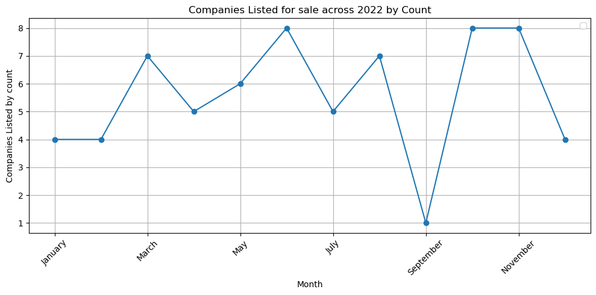

# PRACTICING DATA ANALYSIS USING PANDAS,MATPLOTLIB AND SEABORN
## OVERVIEW
Downloaded data from kaggle.com ie: 
i).stroke dataset- basically this dataset has patients who are have stroke and those who dont together with other variables that I was able to play around with.

ii). Companies.csv - This are companies that were listed on acquire.com with their different revenues and tech stack.

### Cleaning data
Did abit of cleaning for the stroke aand companies dataset respectively using pandas:
[stroke_clean.ipynb](python/stroke_clean.ipynb) 

companies_clean.ipynb -
```python
#loading data
df=pd.read_csv('/Users/joe/Desktop/data analysis/data/companies.csv')

#general cleaning
df['date']=pd.to_datetime(df['date'])
df['techStack']=df['techStack'].str.split(',')
df['techStack'] = df['techStack'].apply(lambda x: [tech.strip() for tech in x]) 
```
### Questions I tried to answer using the data sets
1.How different dietary habits affect the individuals hdl cholestrol and    ldl cholestrol.
2.Analysed the symptoms count in stroke patients to find out which symptoms are more prevalent.
3.Finding what the count of patients with hypertension ,stroke and family history of stroke and putting them side by side.
4.Looking at different tech stacks used by companies for sale and finding out which tech stach is associated with more revenue.
5.Finally looking at the count of companies listed for sale according to months of the year

### Results and Visualization
1.
2.
3.
4.
code for the plot:
```python
sns.scatterplot(data=symptoms_stats,x='revenue',y='tech_tools_count',hue="techStack",palette='Dark2')

#adding text labels to the scatter plot
texts=[]

for i ,title in enumerate(symptoms_stats.index):
   texts.append(plt.text(symptoms_stats['revenue'].iloc[i],symptoms_stats['tech_tools_count'].iloc[i],title))

adjust_text(texts)

ax=plt.gca()
ax.xaxis.set_major_formatter(plt.FuncFormatter(lambda x,pos:f'${int(x/1000)}K'))
plt.title('Tech technologies count and the Median revenue generated by companies using them')
plt.ylabel('Tech Count')
plt.xlabel('Revenue(USD$)')
plt.grid(visible=True)
plt.xlim(340000,650000)
plt.legend('')
plt.tight_layout()
plt.show()
```
5.

### Insights
1.Looking at the visualization the non-vegetarian and the gluten-free diets seem to be the best since they have the lowest ldl-cholestrol which is bad cholestrol while also having high hdl cholestrol which is good cholestrol.
2.Blurred vision,Dizziness and difficulty speaking appear to be the 3 most common symptoms among stroke victims according to the dataset.
3.The insight here is that hypertension and strokes dont seem to have a correlation but stroke family history and stroke status may have some correlation.(but more analysis may be necessary)
4.Here AWS seems to be the most prefered techstack while java seems to bring the most revenue but also the least used techstack
5.June,October and November have the highest number of companies listed for sale while September has the least number of companies listed for sale.


